 
## 📌 About
 
This repo is my running log of everything I'm learning on the backend — Node.js, Express, MongoDB, authentication, APIs, DevOps, and eventually AI integration. I check off topics as I finish them, so this README doubles as a **live roadmap** and a **proof-of-work log** for recruiters browsing my GitHub.
 
---
 
## 🗺️ Roadmap

```mermaid
graph LR
    A[JavaScript Fundamentals] --> B[Node.js Core]
    B --> C[Express.js]
    C --> D[MongoDB / Mongoose]
    D --> E[Authentication & Security]
    E --> F[REST API Design]
    F --> G[Testing]
    G --> H[DevOps & CI/CD]
    H --> I[Cloud Deployment]
    I --> J[AI Integration]
 
    style A fill:#84a98c,stroke:#333,color:#000
    style B fill:#84a98c,stroke:#333,color:#000
    style C fill:#84a98c,stroke:#333,color:#000
    style D fill:#cad2c5,stroke:#333,color:#000
    style E fill:#cad2c5,stroke:#333,color:#000
    style F fill:#cad2c5,stroke:#333,color:#000
    style G fill:#eee,stroke:#333,color:#000
    style H fill:#eee,stroke:#333,color:#000
    style I fill:#eee,stroke:#333,color:#000
    style J fill:#eee,stroke:#333,color:#000
```
 

 
> 🟢 Green = Completed &nbsp;&nbsp; 🟡 Light = In Progress / Partial &nbsp;&nbsp; ⚪ Grey = Upcoming
 
---
 
## ✅ Topic Checklist
 
### 1. JavaScript Fundamentals
- [x] Variables, data types, `let` / `const` / `var`
- [x] Operators & operator precedence
- [x] Booleans, null vs undefined
- [x] Loops (`for`, `while`, `for...of`, nested loops)
- [x] Arrays & array methods
- [x] Object literals
- [x] Fetch API & `async/await`
### 2. Node.js Core
- [x] What is Node.js & the Node REPL
- [x] Node file system (`fs`) module
- [x] `process` object & `process.argv`
- [x] Module exports (files & directories)
- [x] npm & installing packages
- [x] `require` vs `import`
### 3. Express.js
- [x] What is Express & getting started
- [x] Handling requests & sending responses
- [x] Routing
- [x] Path parameters & query strings
- [x] `nodemon` setup
- [ ] Middleware (built-in, third-party, custom)
- [ ] Error-handling middleware
- [ ] Express Router (modular routes)
### 4. MongoDB / Mongoose
- [ ] MongoDB basics (documents, collections)
- [ ] Connecting Express to MongoDB
- [ ] Mongoose schemas & models
- [ ] CRUD operations
- [ ] Data validation
- [ ] Aggregation pipeline
- [ ] Indexing basics
### 5. Authentication & Security
- [ ] Password hashing (bcrypt)
- [ ] JWT-based authentication
- [ ] Sessions vs tokens
- [ ] Role-based access control
- [ ] Environment variables & `.env` security
- [ ] CORS handling
### 6. REST API Design
- [ ] REST principles & HTTP status codes
- [ ] API versioning
- [ ] Request validation (Joi / express-validator)
- [ ] Pagination, filtering, sorting
- [ ] API documentation (Swagger/Postman)
### 7. Testing
- [ ] Unit testing (Jest/Mocha)
- [ ] API testing (Supertest)
- [ ] Test-driven development basics
### 8. DevOps & CI/CD
- [x] CI/CD concepts overview
- [ ] GitHub Actions pipeline
- [ ] Docker basics
- [ ] Automated testing in pipeline
### 9. Cloud Deployment
- [x] Explored AWS, Render, Vercel concepts
- [ ] Deploying a live Node/Express API
- [ ] Environment configs for production
- [ ] Custom domain & HTTPS
### 10. AI Integration (Differentiator)
- [ ] OpenAI / Gemini API basics
- [ ] Prompt engineering for backend use cases
- [ ] LangChain fundamentals
- [ ] Retrieval-Augmented Generation (RAG)
- [ ] AI-powered chatbot integration
---
 
## 🛠️ Tech Stack
 
| Layer | Technology |
|---|---|
| Runtime | Node.js |
| Framework | Express.js |
| Database | MongoDB (Mongoose) |
| Auth | JWT, bcrypt |
| AI (planned) | Gemini API, LangChain |
| Deployment | Render / Vercel / AWS |
| Version Control | Git & GitHub |
 
---
 
## 📈 Learning Activity
 

  

  

---
 
## 📬 Connect
 
- GitHub: [abhi7044](https://github.com/abhi7044)
- LinkedIn: [Abhijeet Mishra](https://linkedin.com/in/abhijeet-mishra-140aa3353)
- Email: teslanikola664@gmail.com
---
 

<i>Updated regularly as I progress through backend development. ⭐ Star this repo if you're on a similar journey!</i>

 
